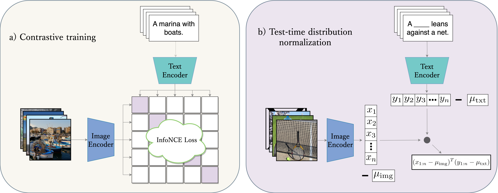

<p align="center">
    
</p>

### Abstract

Advances in the field of visual-language contrastive learning have made it possible for many downstream applications to be carried out efficiently and accurately by simply taking the dot product between image and text representations. One of the most representative approaches proposed recently known as CLIP (Radford et al., 2021) has quickly garnered widespread adoption due to its effectiveness. CLIP is trained with an InfoNCE loss that takes into account both positive and negative samples to help learn a much more robust representation space. This paper however reveals that the common downstream practice of taking a dot product is only a zeroth-order approximation of the optimization goal, resulting in a loss of information during test-time. Intuitively, since the model has been optimized based on the InfoNCE loss, test-time procedures should ideally also be in alignment. The question lies in how one can retrieve any semblance of negative samples information during inference. We propose Distribution Normalization (DN), where we approximate the mean representation of a batch of test samples and use such a mean to represent what would be analogous to negative samples in the InfoNCE loss. DN requires no retraining or fine-tuning and can be effortlessly applied during inference. Extensive experiments on a wide variety of downstream tasks exhibit a clear advantage of DN over the dot product. Our code is available at [https://github.com/fengyuli-dev/distribution-normalization](https://github.com/fengyuli-dev/distribution-normalization).

### Authors

<div>
<div style="text-align: left;">

<div class="person">
  <br>
  <a href="{{ person.url | relative_url }}">{{ person.name }}</a><br>
  <span>{{ person.title | replace: '&', '<br>' }}</span>
</div>

</div></div>
\* indicates equal contribution.

### Citation

Need change after we update paper version on arXiv.

```
@misc{zhou2023distribution,
      title={Distribution Normalization: An "Effortless" Test-Time Augmentation for Contrastively Learned Visual-language Models}, 
      author={Yifei Zhou and Juntao Ren and Fengyu Li and Ramin Zabih and Ser-Nam Lim},
      year={2023},
      eprint={2302.11084},
      archivePrefix={arXiv},
      primaryClass={cs.LG}
}
```

<!-- Text can be **bold**, _italic_, or ~~strikethrough~~.

[Link to another page](./another-page.html).

There should be whitespace between paragraphs.

There should be whitespace between paragraphs. We recommend including a README, or a file with information about your project.

# Header 1

This is a normal paragraph following a header. GitHub is a code hosting platform for version control and collaboration. It lets you and others work together on projects from anywhere.

## Header 2

> This is a blockquote following a header.
>
> When something is important enough, you do it even if the odds are not in your favor.

### Header 3

```js
// Javascript code with syntax highlighting.
var fun = function lang(l) {
  dateformat.i18n = require('./lang/' + l)
  return true;
}
```

```ruby
# Ruby code with syntax highlighting
GitHubPages::Dependencies.gems.each do |gem, version|
  s.add_dependency(gem, "= #{version}")
end
```

#### Header 4

*   This is an unordered list following a header.
*   This is an unordered list following a header.
*   This is an unordered list following a header.

##### Header 5

1.  This is an ordered list following a header.
2.  This is an ordered list following a header.
3.  This is an ordered list following a header.

###### Header 6

| head1        | head two          | three |
|:-------------|:------------------|:------|
| ok           | good swedish fish | nice  |
| out of stock | good and plenty   | nice  |
| ok           | good `oreos`      | hmm   |
| ok           | good `zoute` drop | yumm  |

### There's a horizontal rule below this.

* * *

### Here is an unordered list:

*   Item foo
*   Item bar
*   Item baz
*   Item zip

### And an ordered list:

1.  Item one
1.  Item two
1.  Item three
1.  Item four

### And a nested list:

- level 1 item
  - level 2 item
  - level 2 item
    - level 3 item
    - level 3 item
- level 1 item
  - level 2 item
  - level 2 item
  - level 2 item
- level 1 item
  - level 2 item
  - level 2 item
- level 1 item

### Small image


### Large image


### Definition lists can be used with HTML syntax.

<dl>
<dt>Name</dt>
<dd>Godzilla</dd>
<dt>Born</dt>
<dd>1952</dd>
<dt>Birthplace</dt>
<dd>Japan</dd>
<dt>Color</dt>
<dd>Green</dd>
</dl>

```
Long, single-line code blocks should not wrap. They should horizontally scroll if they are too long. This line should be long enough to demonstrate this.
```

```
The final element.
``` -->
